# PAYRAKSHA 360 — Think Before You Pay

**An explainable, pre-payment scam defence system: a bank console, a GPay-style phone app and an AI vendor auditor, all linked live.**

Team **PHOENIX** · ABISHEKH PRADHOSH M P A · SUHASHA V · YESWANT V

> ⚠️ **DEMO ENVIRONMENT — NO REAL PAYMENTS.** This is a hackathon demonstration prototype. It never initiates, authorises or simulates a real UPI/bank transaction, never asks for a UPI PIN, OTP, password, CVV or card number, and never connects to a real bank. Every recipient, amount, QR code, alert and statistic is **SIMULATED HACKATHON DATA**. The login code `3023` and payment code `2026` are fixed **demo codes**, checked locally and never stored or sent.

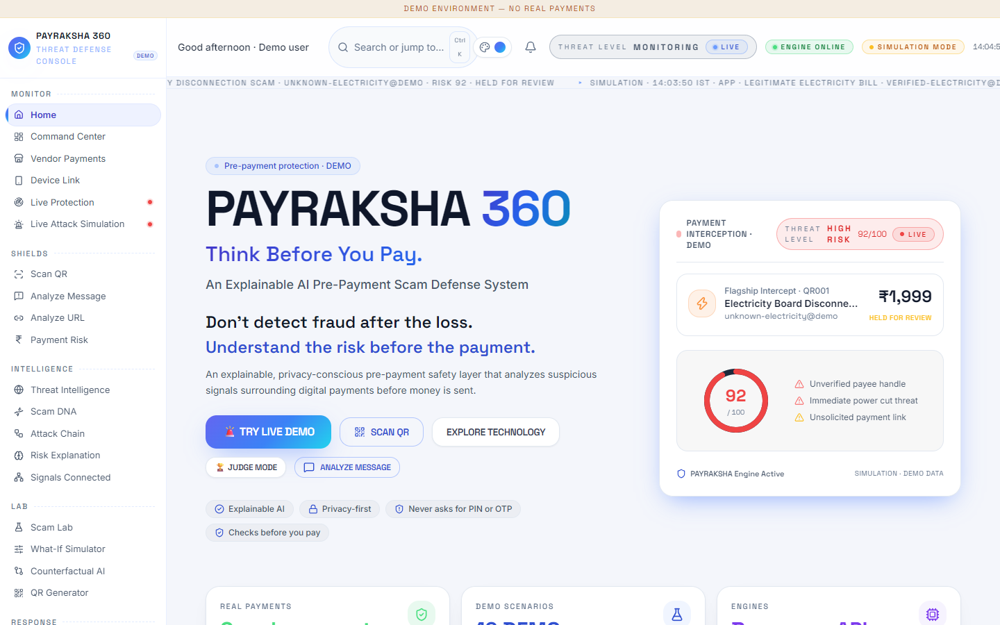

---

## Contents

1. [The problem and our reasoning](#1-the-problem-and-our-reasoning)
2. [What is in the box](#2-what-is-in-the-box)
3. [How it works](#3-how-it-works)
4. [Quick start (Windows exe)](#4-quick-start-windows-exe)
5. [Walkthrough: the phone app (RakshaPay)](#5-walkthrough-the-phone-app-rakshapay)
6. [Walkthrough: the bank console](#6-walkthrough-the-bank-console)
7. [Walkthrough: the AI Auditor](#7-walkthrough-the-ai-auditor)
8. [Using RakshaPay on a real phone (Tailscale)](#8-using-rakshapay-on-a-real-phone-tailscale)
9. [A 3-minute demo script](#9-a-3-minute-demo-script)
10. [Running from source](#10-running-from-source)
11. [Scoring model](#11-scoring-model)
12. [Safety principles](#12-safety-principles)
13. [Project structure](#13-project-structure)

---

## 1. The problem and our reasoning

Most fraud systems ask **"was this transaction fraudulent?"**, after the money has already left. By then the victim has typed their PIN, the money has moved and recovery is slow and uncertain.

UPI scams in India rarely rely on a single red flag. They rely on a **combination** of believable pieces:

* a message that sounds official ("Your electricity will be disconnected tonight"),
* a QR code or link that looks legitimate,
* a payee the user has **never paid before**,
* **time pressure** and often a **phone call** or **screen-share** running at the same moment.

Each piece on its own looks harmless, which is why single-rule filters miss them. So PAYRAKSHA 360 asks a different question, **before** the user pays:

> **"Does this payment situation make sense?"**

Design decisions that follow from that:

| Decision | Reasoning |
|---|---|
| **Check before pay, not after** | The only moment a user can still be protected is before they confirm. Scanning a QR therefore always opens a **check screen**, never a payment. |
| **Combine signals, not single rules** | Message text, URL, QR payload, payee history, amount, channel and behaviour (on a call? sharing screen?) are scored together, with **combination bonuses** when dangerous pairs appear (e.g. *urgency + unknown payee*). |
| **Explainable scores** | Every score comes with the top reasons in plain language, a **Scam DNA** fingerprint and an **attack chain**. Users (and bank staff) must understand *why*, not just see a red number. |
| **Never claim certainty** | Wording is always "Suspicious", "Potentially risky", "Multiple warning signals detected". A tool that says "this IS fraud" will be wrong sometimes, and users stop trusting it. |
| **Context changes the answer** | The same QR is 70 (HIGH CAUTION) alone, but goes higher when the user says "I'm on a call with them". The phone app lets users add that context in one tap. |
| **Friction proportional to risk** | Low risk → normal pay. High risk → the main button becomes **Cancel payment**; paying anyway needs a 3-second **hold** plus the demo code. |
| **Bank sees what the phone sees** | Every check on the phone is mirrored live on the bank console, so staff can spot campaigns and help customers in real time. |
| **Works offline** | The risk engine runs in Python (backend) and has a JavaScript twin that runs in the browser when the backend is unreachable. Both are parity-tested against the same golden dataset. |

---

## 2. What is in the box

One Windows exe (or one FastAPI process from source) serves **three apps**:

| App | Default port | Who uses it | What it does |
|---|---|---|---|
| **Bank Console** | `http://localhost:7480` | Bank / fraud-ops staff, judges | Command centre, live phone link, QR / message / URL / payment analysers, Scam DNA, attack chain, vendor payments map, reports |
| **RakshaPay** | `http://localhost:7481` | The customer, on a phone | GPay-style payment app that checks every QR / payee **before** paying |
| **AI Auditor** | `http://localhost:7482` | Bank risk team | Audits merchant/vendor payments with an AI model (or a simulated auditor when offline) and explains the red flags |

The release ships as three copies of the same exe; the file name decides which app opens:

```
1-Bank-Console.exe   → opens the Bank Console
2-RakshaPay.exe      → opens RakshaPay
3-AI-Auditor.exe     → opens the AI Auditor
```

Starting any one of them starts the shared server; starting a second one just opens its page on the running server.

---

## 3. How it works

```
                ┌──────────────────────── one FastAPI process ───────────────────────┐
  Phone ──────► │  RakshaPay  :7481  ─┐                                               │
  (camera /     │                     ├──►  /api/analyze  ──►  Risk engine (Python)   │
   gallery /    │  Bank Console :7480 ─┤        │                 ▲ parity-tested     │
   samples)     │                     │        ▼                 │ with JS twin      │
                │  AI Auditor  :7482  ─┘   /api/link/*  ──►  Live link store ────────┼──► Console toasts,
                │                          (scan, decision,   (in-memory, last 50)    │    Device Link feed,
                │                           events, target)                          │    Scam DNA / Explain
                │                          /api/bank/*  ──►  Vendor DB (Postgres or   │
                │                                            SQLite fallback) + AI    │
                └────────────────────────────────────────────────────────────────────┘
```

**Step by step, for one scan:**

1. **Capture.** RakshaPay reads a QR from the camera, a gallery image, a demo sample, or the QR the console is currently showing.
2. **Parse.** The UPI payload (`upi://pay?pa=…&pn=…&am=…`) is split into payee, name, amount and note. Non-payment QRs (URLs, text) are flagged as *"This QR is not a payment"*.
3. **Score.** The engine extracts signals (urgency words, impersonation, unknown payee, amount anomaly, suspicious URL, QR redirection, channel, behaviour), applies weights and combination bonuses, and returns a **0–100 score**, a **level**, the **top reasons**, the **Scam DNA** and the **attack chain**.
4. **Decide.** The phone shows a gauge and reasons. The main action depends on the level (see table below). The user can add context chips (*on a call*, *asked to share screen*, *"scan to receive money"*) which re-score instantly.
5. **Mirror.** The check is posted to `/api/link/scan`; the console receives it within about a second (toast + Device Link feed), and the user's decision (cancelled / verify / trusted contact / paid demo) updates it.
6. **Explain.** The same report drives the console's Risk Explanation, Scam DNA and Attack Chain pages.

| Level | Score | Phone's main action |
|---|---|---|
| **LOW RISK** | 0–29 | **Pay ₹X (demo)** → confirm → demo code `2026` |
| **CAUTION** | 30–59 | **Verify payee** first; paying is a secondary option |
| **HIGH CAUTION** | 60–79 | **Cancel payment**; "Pay anyway" needs a 3-second hold + code |
| **HIGH RISK** | 80–100 | **Cancel payment**; same hold-to-pay friction |

---

## 4. Quick start (Windows exe)

1. Download the three exes (or build them, see [§10](#10-running-from-source)) into one folder.
2. Double-click **`1-Bank-Console.exe`**. A console window shows the addresses and your browser opens `http://localhost:7480`.
3. Double-click **`2-RakshaPay.exe`** to open the phone app at `http://localhost:7481` (on a desktop it appears inside a phone frame).
4. Double-click **`3-AI-Auditor.exe`** to open the auditor at `http://localhost:7482`.

Useful flags:

| Flag | Meaning |
|---|---|
| `--no-browser` | Start the server without opening a browser |
| `--port 7480 --pay-port 7481 --audit-port 7482` | Choose ports |
| `--open console\|pay\|audit` | Which page to open |
| `--lan` | Let RakshaPay answer on all network interfaces (for phones without Tailscale HTTPS; no camera) |
| `--no-pay` | Don't serve RakshaPay |

Stop everything by closing the console window.

---

## 5. Walkthrough: the phone app (RakshaPay)

### 5.1 Log in with the demo code

| | |
|---|---|
| 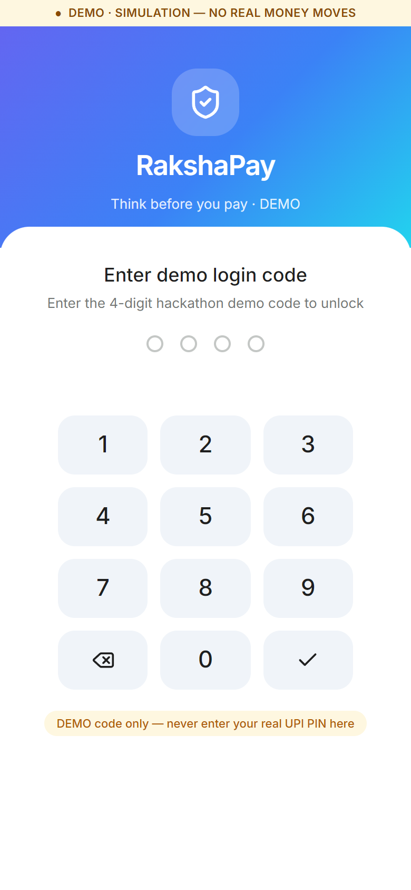 | Open `http://localhost:7481`. Enter the **demo login code `3023`** with the keypad (or type it on the keyboard). A wrong code shakes the dots and shows *"Incorrect demo code"*. The yellow note reminds the user this is **never** their real UPI PIN. The login lasts for the browser tab's session. |

### 5.2 Home

| | |
|---|---|
| 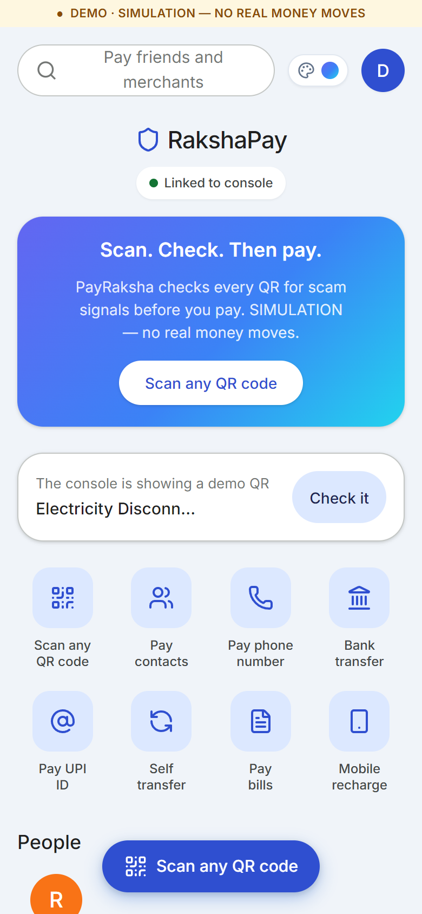 | GPay-style home: search, **Scan any QR code**, the action grid, People and Businesses. **"Linked to console"** means checks are mirrored to the bank console. The palette button (top right) switches colour themes. When the console is presenting a QR, a card offers **Check it** in one tap. Actions that are not part of the demo show a *"Demo only"* toast. |

### 5.3 Scan a QR

Tap **Scan any QR code**. You can:

* point the **camera** at a QR (needs HTTPS on phones, see [§8](#8-using-rakshapay-on-a-real-phone-tailscale)); if the camera is blocked or silent, a help card with **Try again** appears instead of a black screen;
* **Upload from gallery**: pick a screenshot or photo of a QR;
* **Scan what the console shows**: checks the QR the Bank Console's Device Link page is presenting;
* **Demo QR samples**: ready-made scam and legitimate QRs.

| | |
|---|---|
| 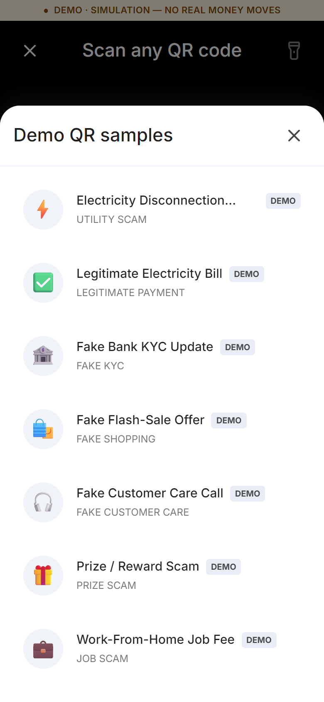 | The samples cover the common Indian UPI scam families: electricity disconnection, fake KYC update, flash-sale, fake customer care, prize, work-from-home job fee, plus a **legitimate** electricity bill to show what "safe" looks like. |

### 5.4 A scam QR: the check screen

| Before context | After "I'm on a call with them" |
|---|---|
| 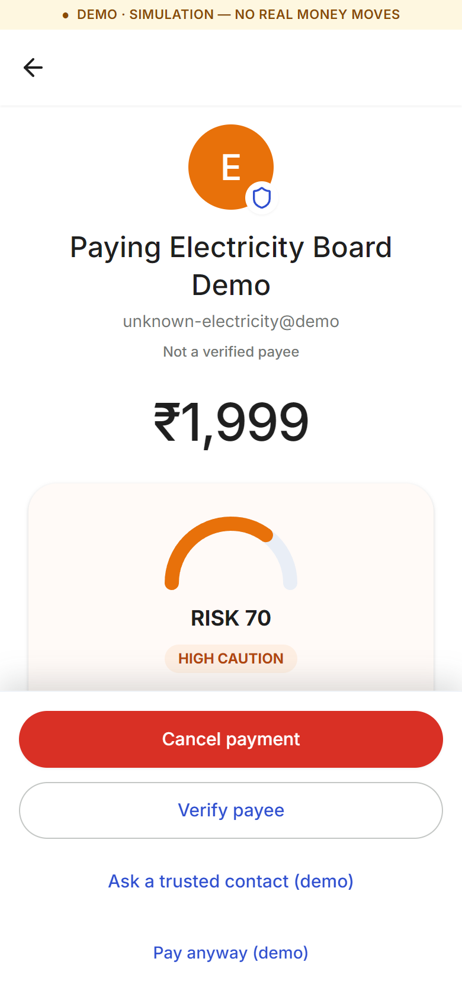 | 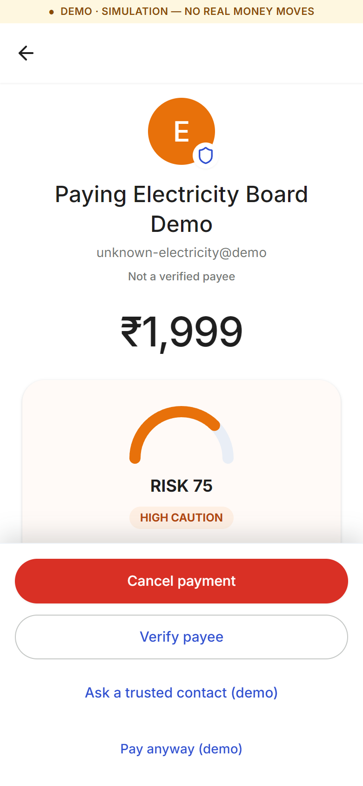 |

The **Electricity Disconnection** sample scores **70 / HIGH CAUTION**:

* *You have never paid unknown-electricity@demo before.*
* *Claims to be the electricity board but the payee is not a verified account.*
* *Pressure to act fast: QR marked urgent.*

The main button is now **Cancel payment** (red). Scroll to **"Anything else happening?"** and tap *I'm on a call with them*; the check re-runs and the score rises (**75**). Adding *They asked me to share my screen* raises it further. **See full analysis** opens the Scam DNA, attack chain and safe actions.

Other options:

* **Verify payee**: a checklist for confirming the payee through an official channel.
* **Ask a trusted contact (demo)**: simulates asking a family member; nothing is actually sent.
* **Pay anyway (demo)**: opens a sheet repeating the warnings, a **hold-to-pay** button (3 seconds) and a *"Don't pay — go back"* button.

### 5.5 Cancelling

| | |
|---|---|
| 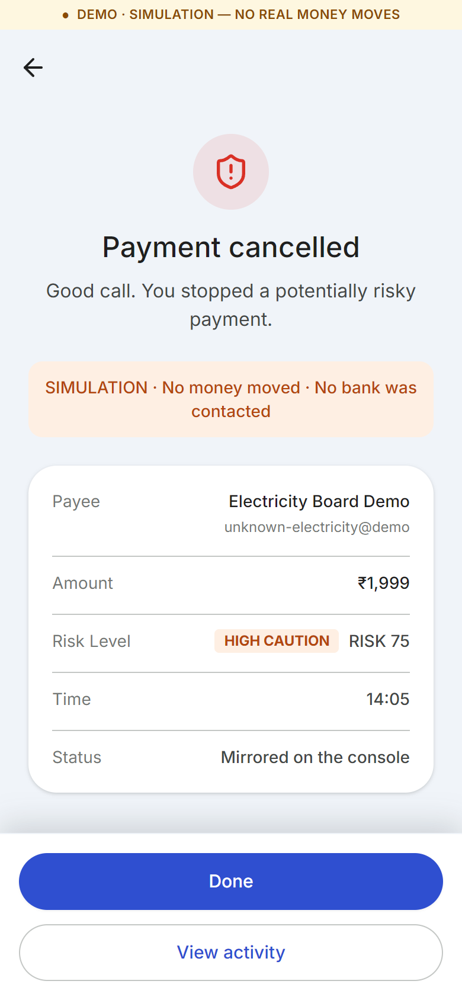 | *"Good call. You stopped a potentially risky payment."* The receipt shows the payee, amount and risk level, and says **SIMULATION · No money moved · No bank was contacted**. Status **Mirrored on the console** confirms the bank saw the decision. |

### 5.6 A safe payment with the demo payment code

| Enter amount | Low-risk check | Demo payment code | Done |
|---|---|---|---|
| 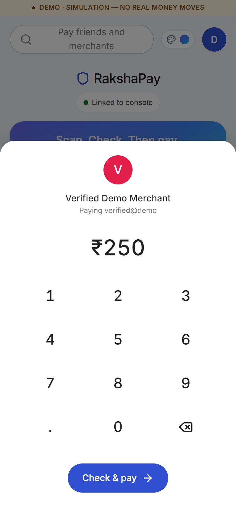 | 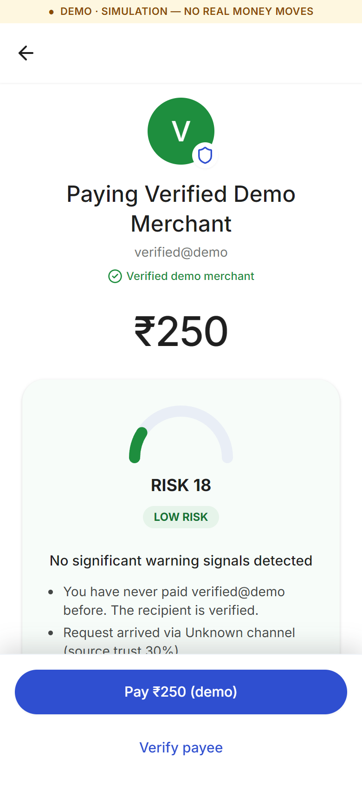 | 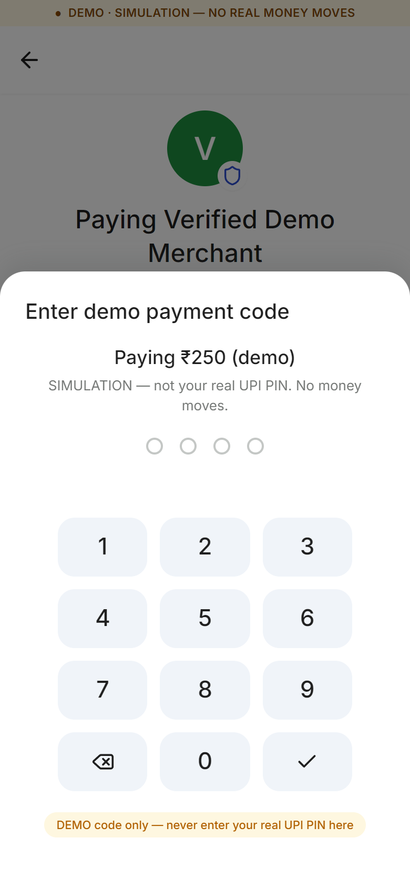 | 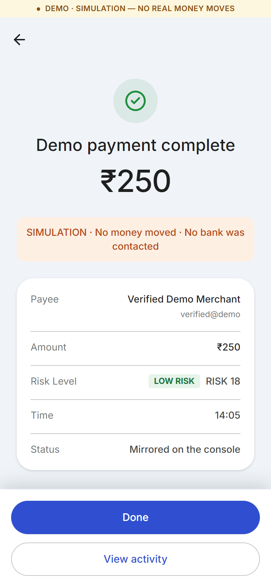 |

1. On Home, tap **Verified** under Businesses.
2. Enter an amount on the keypad (or type it, then press **Enter**) and tap **Check & pay**.
3. The check scores **18 / LOW RISK** (verified payee, no warning signals). Tap **Pay ₹250 (demo)** → **Confirm (demo)**.
4. Enter the **demo payment code `2026`**. It is labelled *"SIMULATION — not your real UPI PIN. No money moves."*
5. **Demo payment complete** shows the receipt, again marked *No money moved*.

**Activity** (bottom of Home) lists every check and decision; **Profile** lets you rename the device (shown on the console) or reset the demo.

---

## 6. Walkthrough: the bank console

Open `http://localhost:7480`. The left sidebar groups the pages into **Monitor**, **Shields**, **Intelligence**, **Lab**, **Response** and **System**. Press **Ctrl + K** to search/jump to any page or run a demo scenario. The palette button in the top bar switches colour themes; **Judge Mode** (top right) is a guided tour.

### 6.1 Device Link: watch the phone live

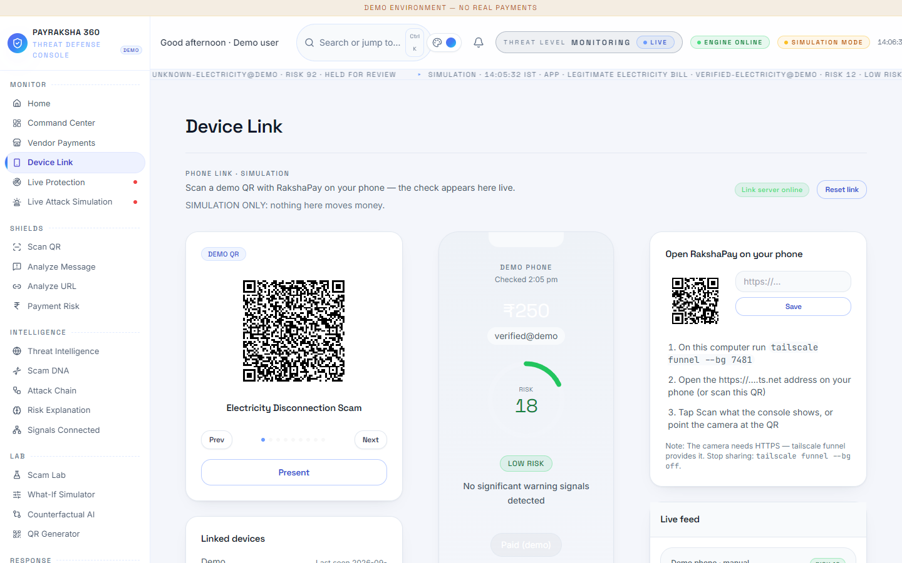

* **Left:** a carousel of demo QRs. Press **Present** to show one full-screen so a phone can scan it (or use *Scan what the console shows* on the phone).
* **Middle:** a live mirror of the last phone check (amount, payee, risk gauge, level, decision).
* **Right:** a QR that opens RakshaPay on a phone, the Tailscale steps, the linked devices and the live feed.

Every phone check also pops a toast on whatever console page is open, and the Risk Explanation / Scam DNA / Attack Chain pages switch to that payment.

### 6.2 Command Center

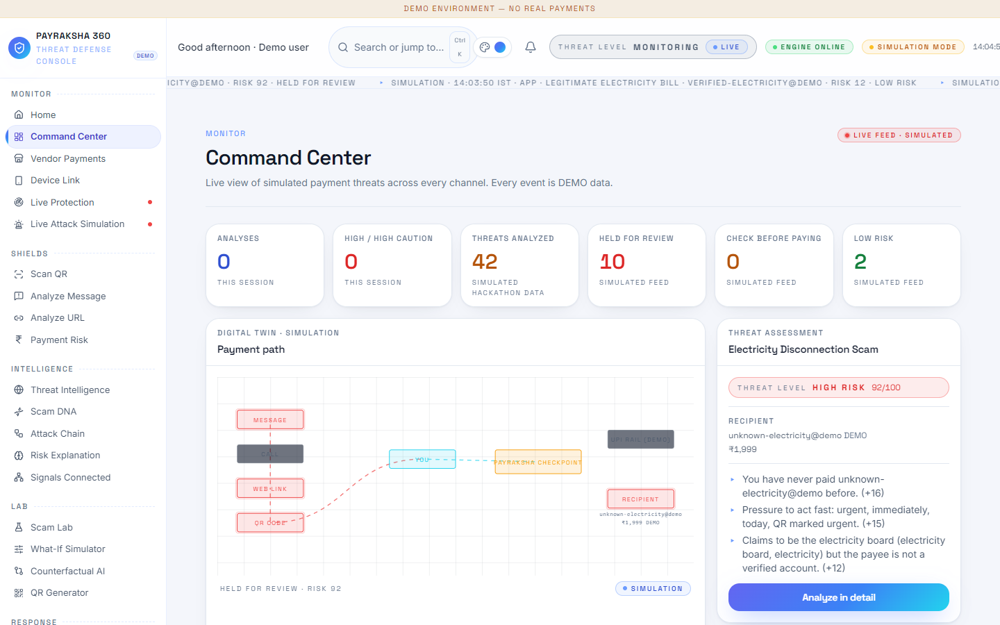

Simulated KPIs (payments checked, held, high-risk), the payment path of the current case and a live activity ticker. All figures are **SIMULATED HACKATHON DATA**.

### 6.3 Shields: analyse anything suspicious

| Scan QR | Analyze Message |
|---|---|
| 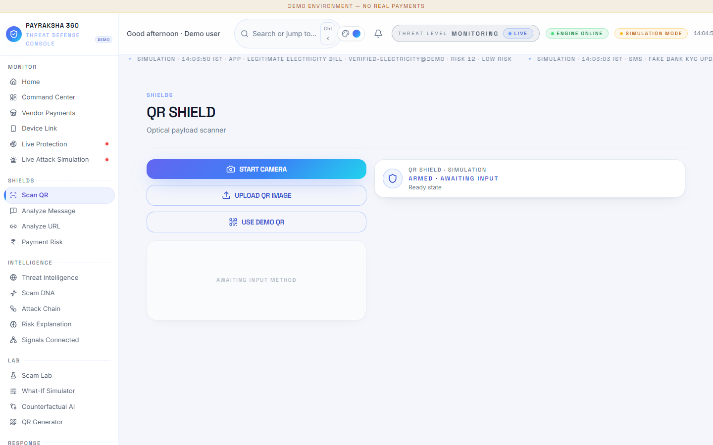 | 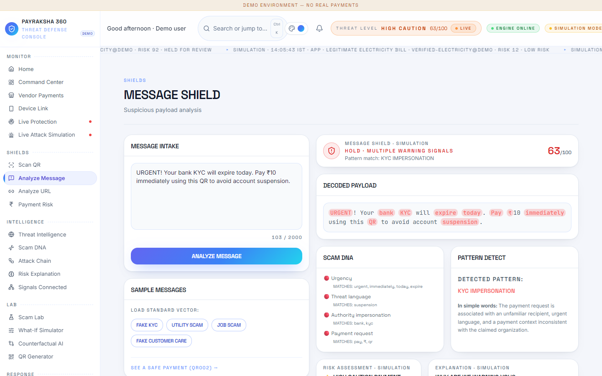 |

* **Scan QR** (`/qr`): webcam, image upload or demo QR; decodes the UPI payload and scores it.
* **Analyze Message** (`/message`): paste an SMS/WhatsApp/email or load a sample (Fake KYC, Utility scam, Job scam…). Suspicious words are highlighted, with Scam DNA and a plain-language explanation.
* **Analyze URL** (`/url`): look-alike domains, risky TLDs, IP-address hosts, misleading paths; no network request is made.
* **Payment Risk** (`/payment`): payee novelty, amount vs. baseline, channel and behaviour.

### 6.4 Intelligence: why it is risky

| Risk Explanation | Scam DNA |
|---|---|
| 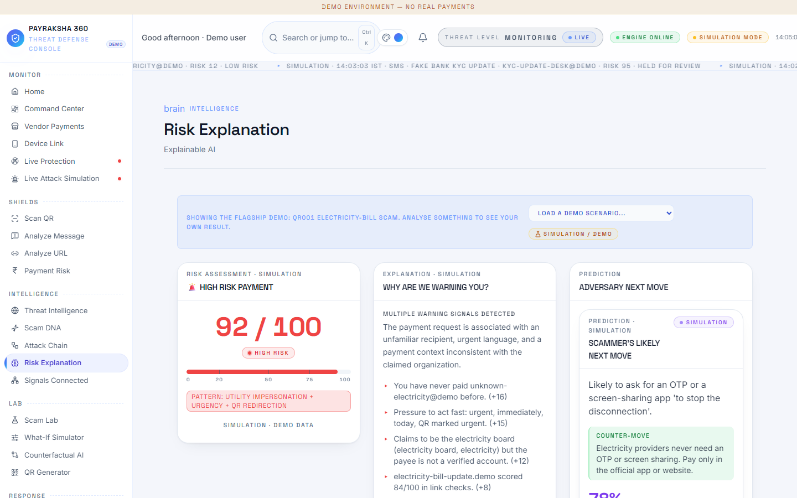 | 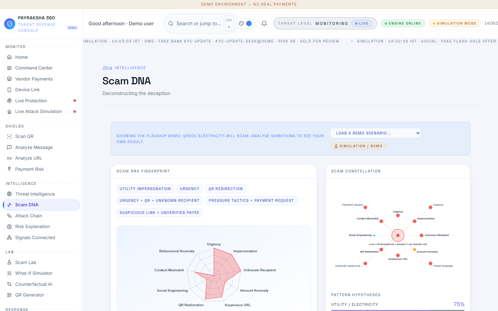 |

* **Risk Explanation** (`/explain`): the score, why we are warning, the adversary's likely next move and the safest next step.
* **Scam DNA** (`/dna`): the pattern fingerprint (radar + strand bars), a DNA strip and the **Scam Constellation** linking each signal to the pattern.
* **Attack Chain** (`/attack-chain`): the scam as stages (message → urgency → impersonation → QR redirection → unknown payee → payment request).

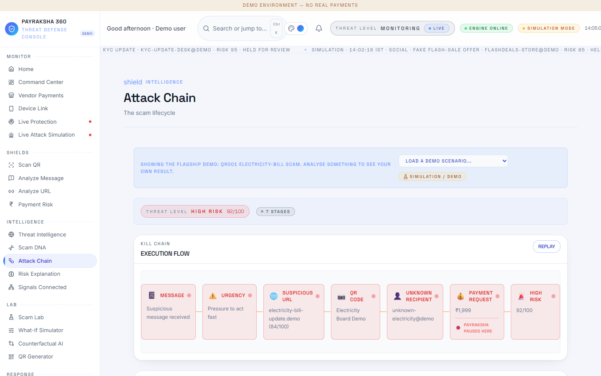

* **Threat Intelligence** (`/threat-intel`): simulated scam trends and categories.
* **Signals Connected** (`/signals`): how the individual signals combine.

### 6.5 Vendor Payments (bank merchant view)

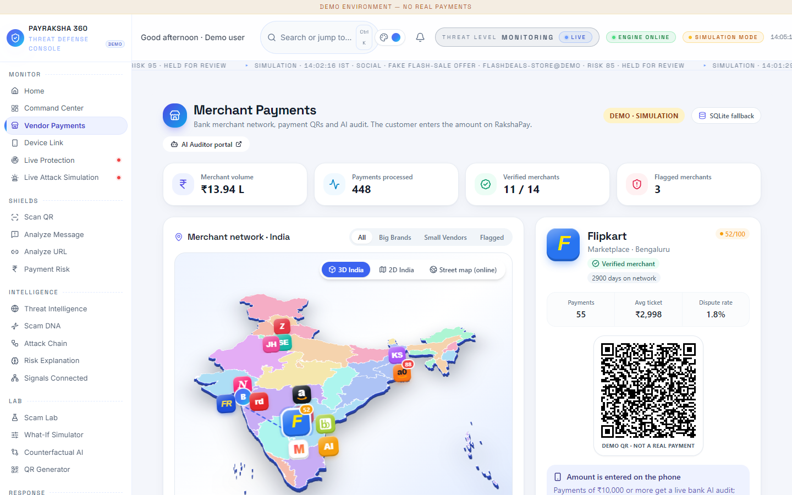

A 3D offline map of India with every demo merchant pinned by city (switch to 2D, or to a street map when online). Click a merchant to see its profile, recent payments and its latest **AI audit** score; **Audit** sends it to the AI Auditor.

### 6.6 Lab and Response

| Live Attack Simulation | Incident Report | Elder Mode |
|---|---|---|
| 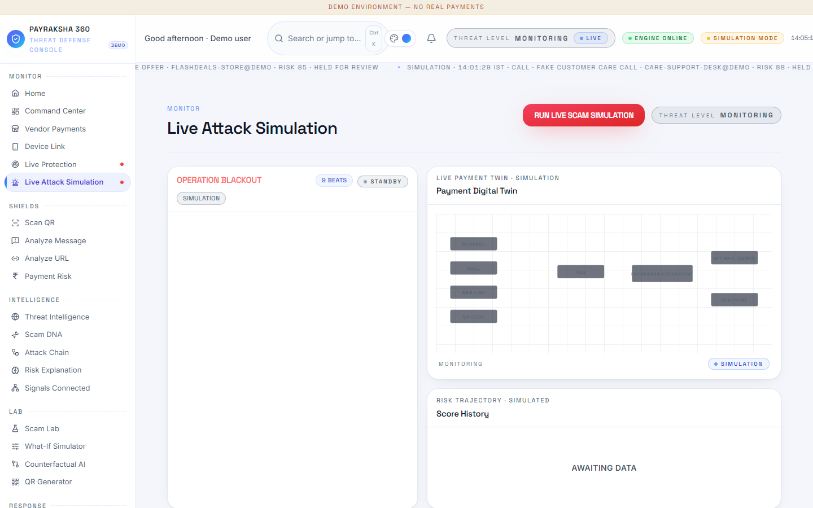 | 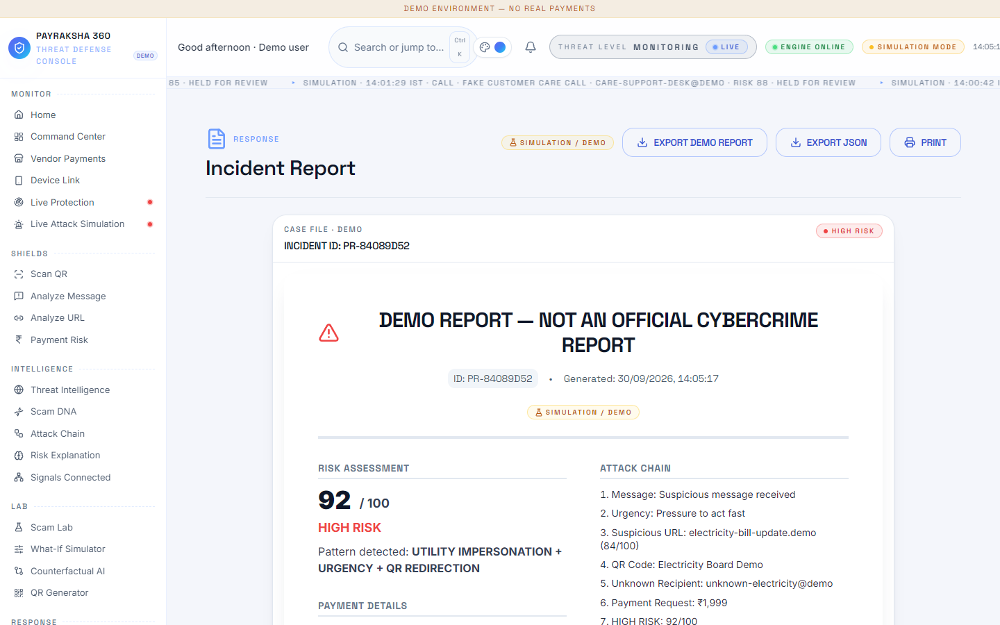 | 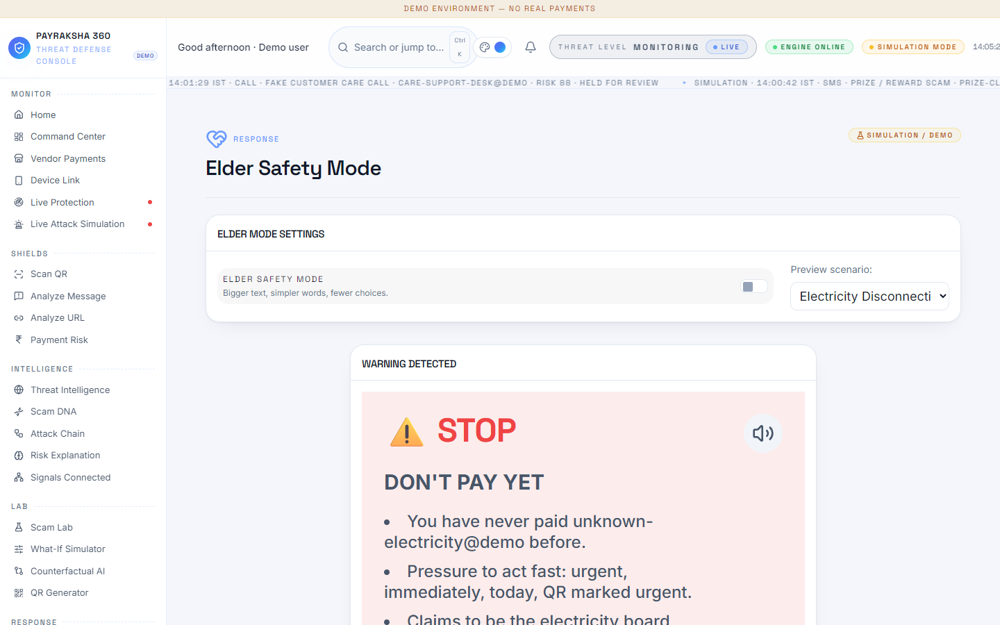 |

* **Live Attack Simulation**: plays a multi-stage scam step by step.
* **Scam Lab / What-If / Counterfactual AI**: change one signal and see how the score moves ("what would make this safe?").
* **QR Generator**: create demo QRs and send one to the phone target.
* **Incident Report**: a printable/exportable summary watermarked **DEMO REPORT — NOT AN OFFICIAL CYBERCRIME REPORT**.
* **Elder Mode**: large, simple **STOP — DON'T PAY YET** warnings for elderly users.
* **Trusted Contact**: a simulated "ask a family member" flow (nobody is contacted).
* **Demo Control Center**: load scenarios and reset state for a clean demo.

---

## 7. Walkthrough: the AI Auditor

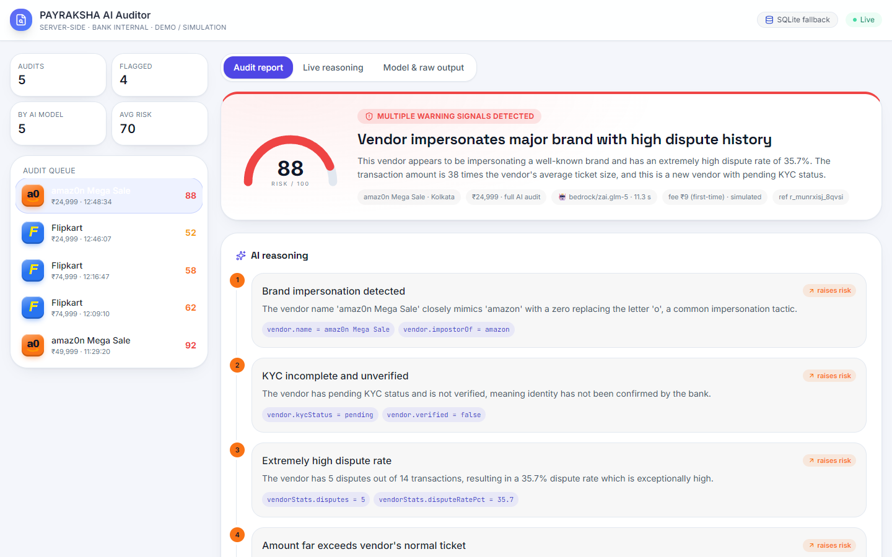

Open `http://localhost:7482`. The **audit queue** (left) lists merchant payments with their risk. Selecting one shows:

* a score and a one-line finding (e.g. *"Vendor impersonates major brand with high dispute history"*),
* **AI reasoning**: each red flag with the evidence pulled from the bank database (look-alike brand name, KYC pending, dispute rate, amount vs. normal ticket),
* **Live reasoning** and **Model & raw output** tabs showing exactly what the model received and returned.

The auditor calls an OpenAI-compatible endpoint (OmniRoute) set by `OMNIROUTE_BASE_URL` / `OMNIROUTE_API_KEY` / `PAYRAKSHA_AUDIT_MODEL`. If it is unreachable, or `PAYRAKSHA_AUDIT_AI=0`, a **simulated auditor** produces the report so the demo never breaks. Vendor data lives in Postgres (`docker compose up -d db`) and falls back to SQLite at `~/.payraksha/bank.db` automatically.

---

## 8. Using RakshaPay on a real phone (Tailscale)

Phone browsers only allow the camera on **HTTPS** pages. Tailscale gives your computer a free HTTPS address.

1. Install [Tailscale](https://tailscale.com/download) on the computer and log in.
2. Start the exe, then in a terminal on the computer run:
   ```
   tailscale funnel --bg 7481
   ```
   It prints an address like `https://your-pc.your-tailnet.ts.net`.
3. Open that address on the phone (or scan the QR on the console's **Device Link** page). Log in with `3023`.
4. Scan a QR shown on the console's Device Link page with **Scan any QR code**. The phone shows the threat level and the console mirrors it live.
5. Stop sharing when done:
   ```
   tailscale funnel --bg off
   ```

`tailscale funnel` makes the page reachable from the internet while it runs. Use `tailscale serve --bg 7481` instead to limit it to devices on your tailnet (the phone must have Tailscale installed). Without HTTPS, gallery upload, demo samples and *Scan what the console shows* still work; only the live camera needs HTTPS.

---

## 9. A 3-minute demo script

1. **Console → Device Link.** "This is the bank's view. The QR on screen is a fake electricity-bill QR."
2. **Phone → Scan any QR code** → scan it (or *Scan what the console shows*). Phone shows **RISK 70 · HIGH CAUTION** with three plain reasons; the console toasts the same check.
3. **Phone → "I'm on a call with them".** Score rises. "The same QR is more dangerous when the scammer is on the line."
4. **Phone → Cancel payment.** "No money moved", and the console marks the case *cancelled*.
5. **Console → Scam DNA / Attack Chain.** Show *why*: impersonation + urgency + unknown payee + QR redirection.
6. **Phone → Verified merchant → ₹250.** **RISK 18 · LOW RISK** → Pay (demo) → code `2026` → done. "Safe payments stay fast."
7. **Console → Vendor Payments → Audit**, then the **AI Auditor** explaining a look-alike merchant.

---

## 10. Running from source

**Prerequisites:** Node.js 20+, Python 3.13, (optional) Docker Desktop for Postgres.

```bash
# 1. Frontend dependencies
npm install

# 2. Backend virtual environment
py -3.13 -m venv backend/.venv
./backend/.venv/Scripts/python -m pip install -r backend/requirements.txt
#   (macOS/Linux: python3.13 -m venv backend/.venv && ./backend/.venv/bin/pip install -r backend/requirements.txt)

# 3. (Optional) Postgres for vendor data; otherwise SQLite is used automatically
docker compose up -d db

# 4. Run everything in dev mode
npm run dev:all
#   API        http://127.0.0.1:8000
#   Console    http://localhost:5173
#   RakshaPay  http://localhost:5174
```

| Command | What it does |
|---|---|
| `npm run dev:all` | Backend + console + RakshaPay dev servers (`npm run dev:auditor` for the auditor) |
| `npm run build` | Production build of all three apps (`dist`, `dist-pay`, `dist-auditor`) |
| `npm run build:exe` | Build + package the Windows exe into `release/PAYRAKSHA360.exe` (PyInstaller) |
| `npm run typecheck` | TypeScript check |
| `npm test` | Vitest: frontend, phone app and acceptance tests |
| `npm run test:py` | Pytest: engine golden-parity, link API, launcher |
| `npm run smoke` | Starts the app and checks it responds |
| `npm run test:exe` | Starts the built exe and checks all ports and the phone→console link |

Optional environment variables:

| Variable | Purpose |
|---|---|
| `OMNIROUTE_BASE_URL`, `OMNIROUTE_API_KEY`, `PAYRAKSHA_AUDIT_MODEL` | AI Auditor model endpoint |
| `PAYRAKSHA_AUDIT_AI=0` | Force the simulated auditor |
| `PAYRAKSHA_DB_URL` / `PAYRAKSHA_DB=sqlite` | Vendor database |
| `PAYRAKSHA_PHONE_URL` | Public RakshaPay URL shown in the console's "Open on your phone" QR |

---

## 11. Scoring model

The score is an explainable weighted sum with combination bonuses, clamped to 0–100:

```
Score = clamp(0, 100, Baseline + Σ (Weightᵢ × Factorᵢ) + Σ CombinationBonuses)
```

| Factor | Weight |
|---|---|
| Baseline | 12 |
| Recipient novelty (never paid before) | 16 |
| Urgency pressure | 15 |
| Behavioural anomaly (on a call, screen share) | 14 |
| Impersonation indicators | 12 |
| Suspicious URL patterns | 10 |
| Amount anomaly | 8 |
| Social-engineering cues (threat, lure, secrecy) | 8 |
| Context / channel mismatch | 8 |
| QR redirection / flag | 6 |
| Untrusted channel source | 3 |

Weights, lexicons and scenarios live in `shared/*.json`, used by both the Python engine (`backend/app/engine.py`) and the JavaScript reference engine (`shared/reference/engine.mjs`). `shared/golden/golden.json` is the parity dataset both must reproduce exactly.

---

## 12. Safety principles

1. **No real money, ever.** No real UPI/bank transaction is initiated, authorised or forwarded. QR scanning never triggers a payment.
2. **No secrets requested.** No UPI PIN, OTP, password, CVV or full card number is ever asked for or stored. The demo codes `3023`/`2026` are fixed demo values checked locally.
3. **No real bank connection** and **no automatic contact** with real people.
4. **Never certain.** Language is "Suspicious", "Potentially risky", "Multiple warning signals detected".
5. **Clearly labelled.** Every screen shows **DEMO / SIMULATION**; statistics are **SIMULATED HACKATHON DATA**; reports say **DEMO REPORT — NOT AN OFFICIAL CYBERCRIME REPORT**.
6. **Real UPI IDs are analysis-only.** A QR with a non-demo UPI ID is checked and masked (`sh•••@okaxis`) but can never be paid.
7. **Offline by default.** No external network calls except the optional AI endpoint and optional street-map tiles, both with offline fallbacks.

---

## 13. Project structure

```
payraksha-360/
├── src/                 # Bank Console (React 19 + Vite + Tailwind)
│   ├── pages/           # Route pages (Device Link, Scam DNA, Vendor Payments, …)
│   ├── components/      # UI kit, risk charts, vendor map, link toaster, command palette
│   ├── services/        # API clients, QR decode/camera, local engine fallback
│   └── theme/           # Colour palettes shared with RakshaPay
├── pay/                 # RakshaPay phone app (GPay-style)
│   └── src/screens/     # Login, Home, Scan, Pay, Outcome, Activity, Profile
├── auditor/             # AI Auditor web app
├── backend/             # FastAPI: risk engine, link API, bank/vendor DB, AI auditor
│   ├── app/
│   └── tests/
├── shared/              # Weights, lexicons, scenarios, reference JS engine, golden dataset
├── packaging/           # Windows launcher + PyInstaller spec
├── scripts/             # dev, build-exe, smoke, test-exe helpers
├── test/acceptance/     # Contract tests written before the implementation
└── docs/                # Specs, RakshaPay notes, screenshots
```

---

*PAYRAKSHA 360 is a hackathon prototype by Team PHOENIX. All data is simulated.*
